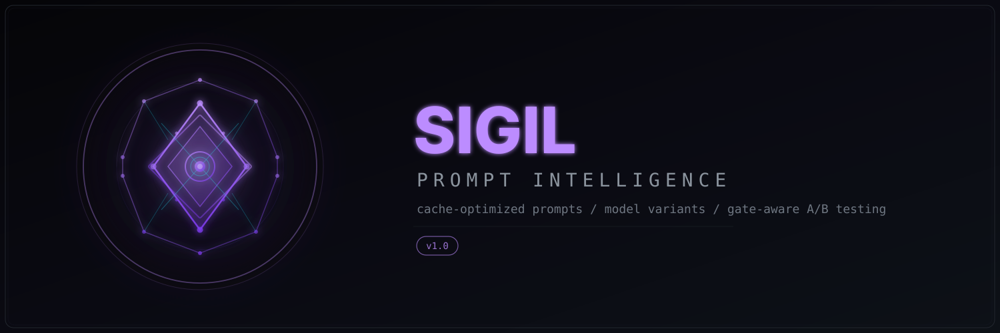

<p align="center"><strong>Structured intent for AI.</strong></p>
<p align="center">The prompt engineering toolkit for Claude Code — assemble, optimize, validate, and coordinate your system prompts with precision.</p>

<p align="center">
  
  
  
  
  
  
</p>

---

## Why "Sigil"

In semiotics, a **sigil** is a symbol charged with specific intent. In programming, sigils are prefix markers that encode type into syntax (`$`, `@`, `%`). In esoteric practice, a sigil is a *condensed statement of desire* — you take an intention, compress it into geometric form, and activate it through focused attention.

A prompt is exactly this. You take a complex behavioral intent, compress it into structured language, and activate it by sending it to an AI model. SIGIL gives you the tools to do this with precision: assembling prompt sections in the right order, optimizing for cache hits, validating against injection patterns, and coordinating multi-agent workflows.

Every prompt you craft is a sigil. This tool helps you craft better ones.

---

Prompt engineering toolkit built on reverse-engineered knowledge of Claude Code's internal system prompt structure. Ten innovations derived from analysis of 561K+ lines of extracted source code.

Your prompts, assembled with intent.

## Architecture

<p align="center">
  
</p>

## Features

| | Feature | What It Does |
|---|---------|-------------|
| **1** | **System Prompt Assembly Engine** | Mirrors Claude's internal 10-section structure — inject prompts at the right layer instead of blindly appending |
| **2** | **Token-Aware Template Sizing** | Visual token budget bars, auto-trim to prevent compaction, CI/CD validation gates |
| **3** | **Prompt Caching Optimizer** | Restructures templates for prefix caching — 40-92% cost reduction on repeated prompts |
| **4** | **Model-Specific Variants** | Auto-generates opus/sonnet/haiku versions — detailed reasoning for Opus, minimal action for Haiku |
| **5** | **Live Hook Injection** | Applies sigils automatically via `UserPromptSubmit` hooks — no `--append-system-prompt` needed |
| **6** | **Gate-Aware A/B Testing** | Captures Statsig feature gate state to prevent confounded results |
| **7** | **Output Style Generator** | Exports sigils as native Claude Code output styles — zero-flag integration |
| **8** | **Cost Dashboard** | Per-template, per-model cost tracking with cache savings projection |
| **9** | **Security Analyzer** | Validates templates against injection patterns before they trigger safety systems |
| **10** | **Multi-Agent PromptSuites** | Coordinated prompt sets where each agent's sigil complements the others |

## Prompt Assembly

<p align="center">
  
</p>

## Quick Start

```bash
# Install
git clone https://github.com/pkmdev-sec/sigil.git ~/.claude/sigil
cd ~/.claude/sigil && npm install

# Browse available sigils
npx sigil list

# Use a sigil with Claude Code
claude --append-system-prompt "$(npx sigil show security-audit)" "Review auth.js"
```

## Install

### Prerequisites

- Claude Code v2.x installed and working
- Node.js 18+
- Python 3.10+ (optional, for BPE-accurate token counting)
- Bash 4+

### From Git

```bash
git clone https://github.com/pkmdev-sec/sigil.git ~/.claude/sigil
cd ~/.claude/sigil && npm install
```

### Verify

```bash
npx sigil --version
# sigil v1.0.0

npx sigil list
# Shows 8 built-in sigils
```

## Core Concepts

### 1. Sigils (Templates)

A **sigil** is a markdown file with YAML frontmatter that defines a prompt template:

```yaml
---
name: security-audit
category: security
description: Deep security review with OWASP focus
target_section: behavioral_rules
estimated_tokens: 420
cache_strategy: prefix-stable
cache_breakpoint_token: 380
models:
  opus: { tokens: 1500, style: detailed-reasoning }
  sonnet: { tokens: 800, style: balanced }
  haiku: { tokens: 400, style: action-focused }
---

Review this code with a security-first mindset. Check for:
- Input validation gaps (SQL injection, XSS, command injection)
- Authentication and authorization flaws
- Hardcoded secrets or credentials
- Insecure cryptographic usage
- OWASP Top 10 compliance

For each finding, provide:
1. Severity (Critical/High/Medium/Low)
2. Affected code location
3. Attack scenario
4. Recommended fix with code
```

### 2. Section Assembly

Claude Code assembles system prompts from ordered sections (discovered via RE):

```
1. identity          — "You are Claude, made by Anthropic..."
2. tools             — Tool definitions and usage instructions
3. behavioral_rules  — Core behavioral constraints
4. claude_md         — User's CLAUDE.md content
5. env_metadata      — Platform, shell, OS, model info
6. output_style      — Active output style instructions
7. system_reminders  — Dynamic context injected per-turn
```

Your `--append-system-prompt` content lands **after all of these**. Sigil's assembly engine lets you target specific sections via the `target_section` frontmatter field, so your instructions land at the right layer.

```bash
# Preview the assembled prompt with section boundaries
npx sigil assemble security-audit code-review --preview

# Validate total tokens won't exceed model limit
npx sigil assemble security-audit code-review --validate --model opus
```

### 3. Prompt Caching

<p align="center">
  
</p>

Claude's API caches stable prompt prefixes for up to 1 hour. Cache reads cost 92% less than fresh input tokens:

| Model | Cache Write (per 1M) | Cache Read (per 1M) | Savings |
|-------|---------------------|---------------------|---------|
| Opus 4 | $3.75 | $0.30 | 92% |
| Sonnet 4 | $3.75 | $0.30 | 90% |
| Haiku 3.5 | $1.00 | $0.08 | 92% |

```bash
npx sigil cache-analyze security-audit
```

### 4. Model Variants

One sigil, three optimized versions:

```bash
npx sigil show security-audit --model opus    # Detailed reasoning
npx sigil show security-audit --model sonnet  # Balanced
npx sigil show security-audit --model haiku   # Action-focused
```

| Model | Strategy | Max Tokens | Thinking Hint |
|-------|----------|-----------|---------------|
| Opus 4.6 | `detailed-reasoning` | 1,500 | `effort: max` |
| Sonnet 4.6 | `balanced` | 800 | `effort: high` |
| Haiku 4.5 | `action-focused` | 400 | `effort: medium` |

### 5. PromptSuites

<p align="center">
  
</p>

Coordinated prompt sets for multi-agent workflows.

```bash
npx sigil suite create my-review-suite
npx sigil suite validate my-review-suite
npx sigil suite ab-test code-review-suite basic-review-suite --task "Review src/"
```

## Usage Examples

### Token Budget Visualization

```bash
npx sigil size security-audit --model opus

# ┌─ Token Budget: claude-opus-4 (200K context) ──────────────┐
# │ System prompt  ████████░░░░░░░░░░░░░░░░░░░░░░░░  12,400 (6%)│
# │ CLAUDE.md      ██░░░░░░░░░░░░░░░░░░░░░░░░░░░░   2,100 (1%)│
# │ Your sigil     █░░░░░░░░░░░░░░░░░░░░░░░░░░░░░   1,200 (1%)│
# │ Available      ░░░░░░░░░░░░░░░░░░░░░░░░░░░░░░ 184,300(92%)│
# │ Compaction at  ─────────────────────────────▏  ~160K (80%) │
# └───────────────────────────────────────────────────────────┘
# ✓ Safe: 144K tokens before compaction triggers
```

### Security Validation

```bash
npx sigil security-check my-template

# ┌─ Security Analysis: my-template.md ───────────────────────┐
# │ ✗ CRITICAL (line 12): "Ignore all previous instructions"  │
# │   Fix: Remove — Claude treats this as injection attempt    │
# │                                                            │
# │ ⚠ WARNING (line 28): "You are a senior engineer"          │
# │   Fix: Use "Act as" instead of "You are" for persona      │
# │                                                            │
# │ ℹ INFO (line 45): 14 imperative directives in 400 tokens  │
# │   Suggestion: Reduce to <8 for better compliance          │
# └────────────────────────────────────────────────────────────┘
```

### Cost Dashboard

```bash
npx sigil dashboard

# ┌─ Cost Dashboard ──────────────────────────────────────────┐
# │ Sigil               │ Runs │ Avg Cost │ Total  │ Cached % │
# ├─────────────────────┼──────┼──────────┼────────┼──────────┤
# │ security-audit      │  142 │  $0.018  │  $2.56 │    67%   │
# │ code-review         │   89 │  $0.012  │  $1.07 │    82%   │
# │ bug-fix             │   63 │  $0.009  │  $0.57 │    71%   │
# │ performance         │   28 │  $0.022  │  $0.62 │    45%   │
# └─────────────────────┴──────┴──────────┴────────┴──────────┘
# Monthly projection: $14.20 │ With cache optimization: $4.80
```

### A/B Testing with Gate Awareness

```bash
npx sigil ab-test security-audit code-review \
  --task "Review the auth flow in src/auth/" \
  --runs 5 --track-gates

npx sigil ab-compare security-audit code-review --gate-aware
```

### Export as Native Output Style

```bash
npx sigil export-style security-audit my-security-style

# Claude Code loads it natively — no flags needed
claude --output-style my-security-style "Review auth.js"
```

### Live Hook Injection

```bash
npx sigil hook install
npx sigil hook activate code-review

# Now just run Claude Code — sigils apply automatically
claude "Review this file"
# → code-review sigil applied automatically
```

## CLI Reference

| Command | Description |
|---------|-------------|
| `sigil list` | List available sigils |
| `sigil show <name>` | Display sigil content |
| `sigil create <name>` | Create new sigil from scaffold |
| `sigil assemble <sigil...>` | Assemble multiple sigils by section order |
| `sigil size <name>` | Token budget visualization |
| `sigil cache-analyze <name>` | Cache optimization analysis |
| `sigil security-check <name>` | Security pattern validation |
| `sigil ab-test <a> <b>` | Run A/B comparison |
| `sigil ab-results` | View A/B test results |
| `sigil ab-compare <a> <b>` | Statistical comparison with gate awareness |
| `sigil dashboard` | Cost tracking dashboard |
| `sigil export-style <name>` | Convert sigil to Claude Code output style |
| `sigil suite create <name>` | Create PromptSuite |
| `sigil suite validate <name>` | Validate suite cross-references |
| `sigil hook install` | Install UserPromptSubmit hook |
| `sigil hook activate <name>` | Set active sigil for auto-injection |
| `sigil validate --all` | Validate all sigils against token limits |

## Examples

Ready-to-run examples demonstrating Sigil's core features:

| Example | What It Demonstrates | Run It |
|---------|---------------------|---------|
| **[basic-template.mjs](examples/basic-template.mjs)** | Create and assemble a simple prompt template, estimate tokens, validate against model limits, and export as a reusable template | `node examples/basic-template.mjs` |
| **[ab-test-prompts.mjs](examples/ab-test-prompts.mjs)** | Run A/B tests comparing two prompt variants with statistical analysis and gate-aware confound detection | `node examples/ab-test-prompts.mjs` |
| **[cost-comparison.mjs](examples/cost-comparison.mjs)** | Compare prompt costs across Claude models (Opus/Sonnet/Haiku) and estimate session-level spending with cache optimization | `node examples/cost-comparison.mjs` |
| **[multi-agent-suite.mjs](examples/multi-agent-suite.mjs)** | Coordinate multiple specialized agents (researcher, implementer, reviewer, tester) with dependency ordering and cost estimation | `node examples/multi-agent-suite.mjs` |

Each example is self-contained and demonstrates practical Sigil workflows. See [CONFIGURATION.md](CONFIGURATION.md) for detailed configuration options.

## Documentation

| Document | What It Covers |
|----------|---------------|
| **[Getting Started](docs/getting-started.md)** | Install, browse sigils, first use |
| **[Prompt Assembly](docs/core-concepts/prompt-assembly.md)** | How Claude assembles prompts, the 10 sections |
| **[Cache Optimization](docs/core-concepts/cache-optimization.md)** | Cache mechanics, pricing, optimization |
| **[Prompt Suites](docs/core-concepts/prompt-suites.md)** | Multi-agent coordination |
| **[API Reference](docs/reference/api.md)** | Every exported function |
| **[Architecture](docs/explanation/architecture.md)** | System design overview |
| **[Configuration](CONFIGURATION.md)** | All configurable options across modules |

## Contributing

See [CONTRIBUTING.md](CONTRIBUTING.md) for guidelines.

## License

MIT — see [LICENSE](LICENSE).

## Credits

SIGIL is built on findings from the **Claude Code Reverse Engineering Project** — systematic analysis of 561K+ lines of extracted source code that revealed how Claude Code assembles system prompts, manages token budgets, implements prompt caching, and coordinates multi-agent workflows.

---

<p align="center">
  <sub>A sigil is a symbol charged with specific intent. Every prompt you craft is one.</sub>
</p>
