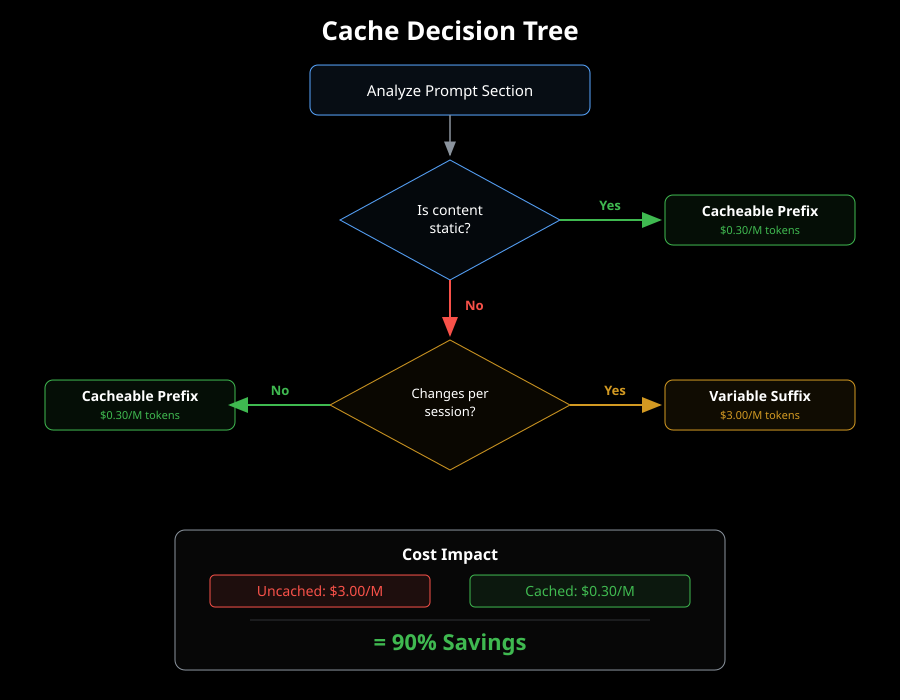

# Prompt Cache Optimization

Claude's API includes prompt caching that can dramatically reduce costs for repeated requests. Understanding how to structure sigils for optimal caching is crucial for production deployments.

## How Prompt Caching Works

Claude's API caches the **stable prefix** of your prompt for up to 1 hour:

- **Cache write**: First request pays full input token cost
- **Cache read**: Subsequent requests within 1 hour pay only 10% for cached prefix
- **Cache miss**: After 1 hour of inactivity, cache expires and requires another write

The cache applies to the longest stable prefix of the prompt. Any change to the cached portion invalidates the entire cache.

## Stable vs. Variable Content

**Stable content** (cacheable):
- System identity and instructions
- Tool definitions
- Static examples and patterns
- Fixed environment metadata

**Variable content** (not cacheable):
- User messages
- Dynamic file paths
- Changing context (git status, file contents)
- Session-specific state

## Sigil Cache Strategies

Specify caching behavior in the sigil frontmatter using the `cache_strategy` field:

### prefix-stable

```yaml
---
name: security-audit
cache_strategy: prefix-stable
cache_breakpoint_token: 1024
---
```

Marks this sigil as cacheable stable content. Sigil will place it early in the prompt to maximize cached prefix length.

### dynamic

```yaml
---
name: file-context
cache_strategy: dynamic
---
```

Marks this sigil as variable content that changes frequently. Sigil will place it after the cache breakpoint to avoid invalidating the cache.

### none

```yaml
---
name: experimental-prompt
cache_strategy: none
---
```

Excludes this sigil from cache optimization. Use for testing or rarely-used prompts.

## Cache Breakpoint Token

The `cache_breakpoint_token` field specifies where to split cacheable vs. dynamic content:

```yaml
cache_breakpoint_token: 2048
```

Sigil ensures all `prefix-stable` sigils are placed before token position 2048, and all `dynamic` sigils after.

## Cost Savings Analysis

Typical cache savings by model (90% reduction on cached tokens):

| Model | Input ($/1M) | Cache Write ($/1M) | Cache Read ($/1M) | Savings (10 requests) |
|-------|-------------|-------------------|------------------|----------------------|
| Opus  | $15.00      | $18.75            | $1.50            | 82%                  |
| Sonnet| $3.00       | $3.75             | $0.30            | 82%                  |
| Haiku | $0.80       | $1.00             | $0.08            | 82%                  |

For a typical 4,000-token stable system prompt with 10 requests/hour:

- **Without caching**: 10 × 4,000 × $3.00/1M = $0.12
- **With caching**: (1 × 4,000 × $3.75/1M) + (9 × 4,000 × $0.30/1M) = $0.026
- **Savings**: 78% reduction

## Cache Analysis Command

Analyze caching efficiency for any sigil:

```bash
npx sigil cache-analyze security-audit
```

Output:
```
Security Audit Cache Analysis
━━━━━━━━━━━━━━━━━━━━━━━━━━━━━━

Static Content:   87% (3,480 tokens)
Dynamic Content:  13% (520 tokens)

Strategy: prefix-stable ✓
Breakpoint: 3,480

Projected Savings (Sonnet, 100 req/month):
  Without cache: $1.20
  With cache:    $0.27
  Savings:       $0.93 (78%)

Recommendation: Optimal caching structure
```

## Visual Reference



This diagram shows how Sigil decides where to place content relative to the cache boundary.

## Best Practices

1. **Place stable content first**: Identity, system instructions, tool definitions, static examples
2. **Place variable content last**: User messages, file context, session state
3. **Use explicit breakpoints**: Set `cache_breakpoint_token` based on your stable content size
4. **Monitor cache hit rates**: Use `npx sigil dashboard` to track cache efficiency over time
5. **Batch similar requests**: Send similar requests within 1-hour windows to maximize cache hits
6. **Avoid unnecessary variability**: Don't include timestamps or random IDs in cacheable sections

## Automated Restructuring

Sigil can automatically restructure prompts for optimal caching:

```bash
npx sigil restructure security-audit --optimize-cache
```

This analyzes content variability and reorganizes sections to maximize the cacheable prefix.

## Advanced: Multi-Tier Caching

For complex workflows, consider multi-tier caching strategies:

- **Tier 1** (stable for weeks): Core identity and tool definitions
- **Tier 2** (stable for hours): Project-specific patterns and examples
- **Tier 3** (per-request): User messages and file context

Structure your sigils with different cache strategies to align with these tiers, maximizing savings across the entire prompt hierarchy.
