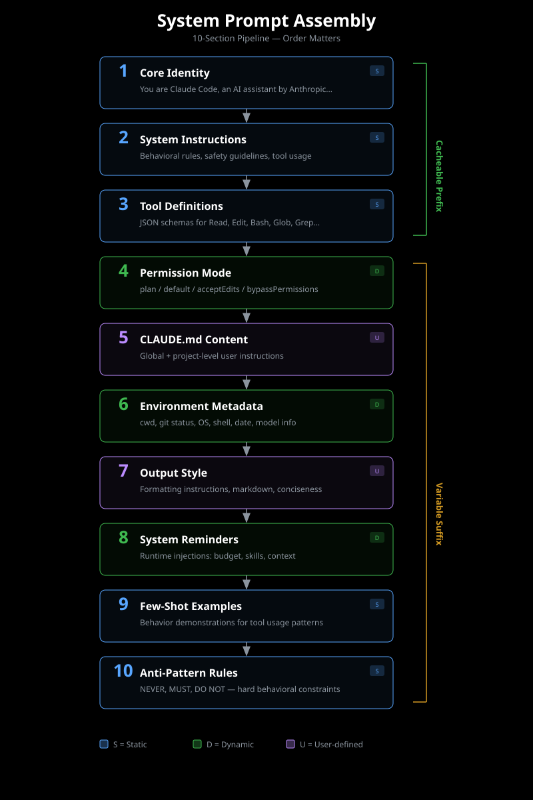

# System Prompt Assembly

Understanding how Claude Code assembles system prompts is essential for creating effective sigils that integrate seamlessly into the agent's behavior.

## Claude Code's Internal Structure

Through reverse engineering of Claude Code's codebase, Sigil has identified 10 distinct sections that comprise the final system prompt:

1. **Identity** — Defines who Claude is and core capabilities
2. **System Instructions** — High-level behavioral guidelines
3. **Tool Definitions** — Available functions and their schemas
4. **Permission Mode** — User consent requirements for actions
5. **CLAUDE.md Injection** — Project-specific instructions from workspace
6. **Environment Metadata** — OS, shell, working directory, git status
7. **Output Style** — Formatting preferences and communication style
8. **System Reminders** — Contextual warnings and requirements
9. **Examples** — Demonstration of desired behavior patterns
10. **Anti-Patterns** — Explicit behaviors to avoid

These sections are assembled in a specific order to ensure optimal prompt structure and caching efficiency.

## The MK Concatenation Pattern

Claude Code uses a concatenation helper called `MK([...])` (found at cli.js:247215) to assemble sections:

```javascript
MK([
  identitySection,
  systemInstructionsSection,
  toolDefinitionsSection,
  // ... remaining sections
])
```

Each section is cached separately using the `systemPromptSectionCache` (cli.js:2089), allowing Claude Code to only regenerate sections that have changed.

## How Sigil Mirrors This Structure

Sigils use the `target_section` frontmatter field to specify which section they contribute to:

```yaml
---
name: security-patterns
target_section: system-instructions
cache_strategy: prefix-stable
model_variants: true
token_budget: 1500
---

# Security Analysis Instructions

When reviewing code for security vulnerabilities:
- Check for injection patterns (SQL, command, XSS)
- Validate input sanitization
- Verify authentication and authorization
...
```

When Sigil assembles prompts, it:

1. Groups sigils by their `target_section`
2. Concatenates sigils within each section
3. Orders sections according to Claude Code's canonical ordering
4. Applies cache optimization strategies

## Section Ordering

Use `getSectionOrder()` from the prompt-assembler module to retrieve the canonical section order:

```javascript
import { getSectionOrder } from './prompt-assembler.mjs';

const order = getSectionOrder();
// Returns: ['identity', 'system-instructions', 'tool-definitions', ...]
```

## Visual Reference



This diagram illustrates how individual sigils are grouped by section, concatenated, and assembled into the final system prompt that Claude Code sends to the API.

## Best Practices

- **Choose the right section**: System instructions for high-level behavior, system reminders for context-specific warnings, examples for demonstrating patterns
- **Respect section boundaries**: Don't mix instruction types across sections
- **Optimize for caching**: Place stable content in early sections, variable content in later sections
- **Test section order**: Use `npx sigil assemble --debug` to visualize section placement

Understanding prompt assembly allows you to create sigils that integrate naturally into Claude Code's existing prompt structure, maximizing effectiveness while minimizing token overhead.
