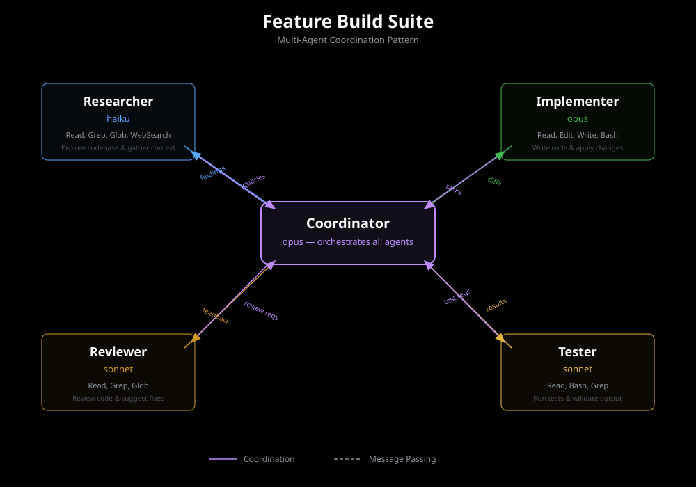

# PromptSuites — Multi-Agent Coordination

PromptSuites enable coordinated multi-agent workflows where specialized prompts work together to accomplish complex tasks.

## What is a PromptSuite?

A PromptSuite is a coordinated set of sigils designed to work together across multiple agent roles. Each role has:

- **Specific responsibilities** — Focused domain expertise
- **Dedicated sigils** — Optimized prompts for that role
- **Model preferences** — Best-fit model for the role's complexity
- **Tool access** — Restricted to necessary capabilities
- **Coordination instructions** — How to hand off between agents

## YAML Schema

PromptSuites are defined in YAML files stored in the `suites/` directory:

```yaml
name: security-audit-suite
version: 1.0.0
description: Comprehensive security audit workflow with specialized agents

roles:
  - name: scanner
    model: haiku
    sigils:
      - security-patterns
      - vulnerability-detection
    tools:
      - grep
      - read
      - glob
    instructions: |
      Scan codebase for security anti-patterns.
      Flag suspicious patterns for deeper analysis.
      Hand off findings to analyzer role.

  - name: analyzer
    model: sonnet
    sigils:
      - threat-modeling
      - exploit-analysis
    tools:
      - read
      - bash
      - web_search
    instructions: |
      Receive flagged patterns from scanner.
      Analyze exploitability and impact.
      Generate detailed threat reports.
      Hand off critical findings to validator.

  - name: validator
    model: opus
    sigils:
      - security-validation
      - compliance-checker
    tools:
      - read
      - bash
      - edit
    instructions: |
      Review analyzer findings for false positives.
      Validate exploitability with proof-of-concept.
      Generate final security report with recommendations.

coordination:
  sequence:
    - scanner -> analyzer (on: findings > 0)
    - analyzer -> validator (on: severity >= high)

  shared_context:
    - findings_log
    - codebase_structure

  token_budget: 100000
  max_iterations: 10
```

## Predefined Suites

Sigil includes several predefined PromptSuites:

### code-review-suite

Three-role workflow: fast scanner (Haiku) → detailed reviewer (Sonnet) → final validator (Opus)

```bash
npx sigil suite run code-review-suite --target src/
```

### security-audit-suite

Specialized security workflow with vulnerability scanning, threat analysis, and validation.

```bash
npx sigil suite run security-audit-suite --scope critical
```

### refactoring-suite

Architecture analysis → pattern extraction → refactoring recommendations → validation.

```bash
npx sigil suite run refactoring-suite --target src/legacy/
```

## Creating Custom Suites

Create a new PromptSuite from scratch:

```bash
npx sigil suite create my-workflow
```

This generates a template YAML file at `suites/my-workflow.yaml`. Edit to define:

1. **Roles**: Name, model, sigils, tools, instructions
2. **Coordination**: Sequence of handoffs and conditions
3. **Shared context**: Data passed between roles
4. **Constraints**: Token budgets and iteration limits

## Validating Suites

Validate suite configuration before deployment:

```bash
npx sigil suite validate my-workflow
```

This checks:

- **Cross-references**: All referenced sigils exist
- **Token budgets**: Combined sigils fit within model context limits
- **Tool availability**: All specified tools are available in Claude Code
- **Coordination logic**: Handoff conditions are valid
- **Model compatibility**: Sigils have appropriate model variants

## Suite-Level A/B Testing

Compare two PromptSuites to determine which workflow is more effective:

```bash
npx sigil suite ab-test security-audit-suite security-audit-suite-v2 \
  --task "Audit src/auth module" \
  --runs 5
```

This runs both suites against the same task and compares:

- **Overall accuracy**: Combined quality across all roles
- **Token efficiency**: Total tokens used across workflow
- **Latency**: End-to-end time to completion
- **Cost**: Total cost across all model invocations
- **Role distribution**: How work is distributed across agents

Results include per-role breakdowns showing which specific agents differ in performance.

## Visual Reference



This diagram illustrates how roles communicate, share context, and hand off work within a PromptSuite.

## Best Practices

1. **Match model to complexity**: Use Haiku for scanning/filtering, Sonnet for analysis, Opus for validation
2. **Minimize handoffs**: Each handoff adds latency and context loss
3. **Share context efficiently**: Only pass necessary data between roles
4. **Set clear handoff conditions**: Define explicit triggers for role transitions
5. **Budget tokens conservatively**: Reserve headroom for variable context
6. **Test coordination logic**: Use `--dry-run` to validate handoff sequences
7. **Monitor token distribution**: Ensure no single role dominates token usage
8. **Version suites**: Track suite versions alongside sigil versions

## Advanced: Dynamic Role Assignment

For complex workflows, use dynamic role assignment based on runtime conditions:

```yaml
coordination:
  dynamic_routing:
    - condition: findings.severity == "critical"
      route_to: expert-validator
    - condition: findings.count > 100
      route_to: batch-processor
    - default: standard-validator
```

This allows PromptSuites to adapt to varying input complexity, optimizing cost and quality.

## Integration with Claude Code

PromptSuites integrate with Claude Code's agent system through:

- **UserPromptSubmit hooks**: Auto-trigger suites based on user intent
- **Context-aware routing**: Match file types to appropriate suites
- **Cost controls**: Respect user-defined budget limits
- **Progress reporting**: Real-time updates during multi-agent execution

Enable auto-routing for a suite:

```bash
npx sigil suite activate security-audit-suite --pattern "**/*.{js,ts,py}"
```

Now security audits automatically use the multi-agent suite when analyzing matching files.
