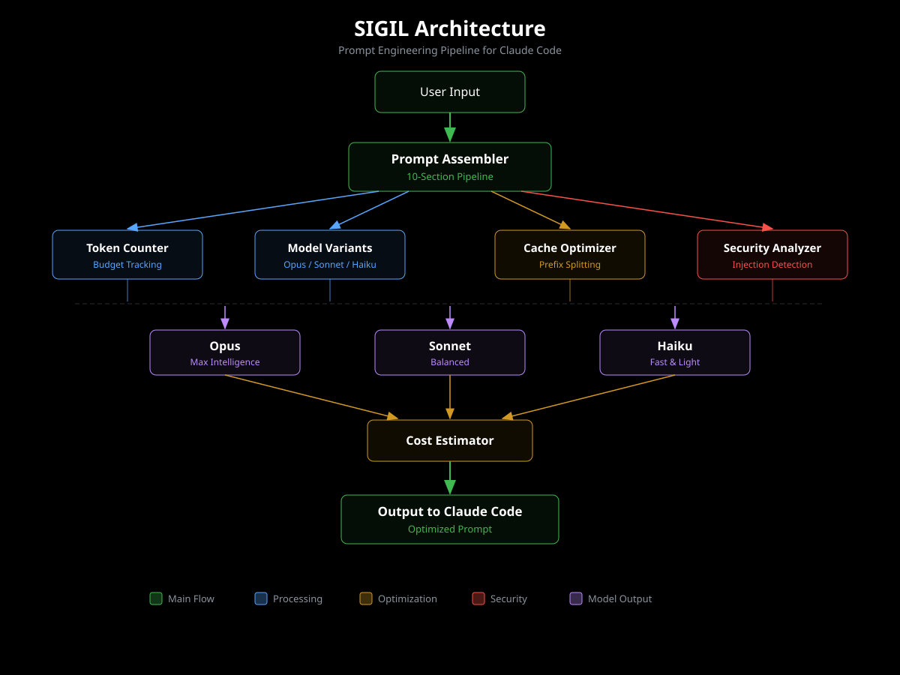

# Architecture Overview

Sigil is a modular prompt engineering toolkit designed to integrate seamlessly with Claude Code. This document explains the system design, data flow, and integration points.

## System Design

Sigil consists of 10 core modules that work together to optimize prompt engineering:

1. **prompt-assembler** — Parses sigil templates and assembles them into complete system prompts
2. **token-counter** — Provides BPE-accurate token counting and budget visualization
3. **cache-optimizer** — Analyzes and restructures prompts for optimal API caching
4. **cost-estimator** — Projects costs across models and request volumes
5. **model-variants** — Auto-generates model-specific prompt variants
6. **security-analyzer** — Scans for injection patterns and security vulnerabilities
7. **output-style-generator** — Converts sigils to/from Claude Code output styles
8. **hook-manager** — Manages automatic sigil injection via Claude Code hooks
9. **gate-aware-ab** — Runs A/B tests with Statsig feature gate awareness
10. **suite-manager** — Orchestrates multi-agent PromptSuite workflows

## Data Flow

The typical lifecycle of a sigil from creation to production:

### 1. Creation
User creates a sigil template with YAML frontmatter and markdown content:

```
templates/my-sigil.md
```

### 2. Parsing
`prompt-assembler.parseTemplate()` reads the file and extracts frontmatter metadata and content:

```
{ frontmatter: {...}, content: "...", filepath: "..." }
```

### 3. Validation
`token-counter.validateTokenLimit()` ensures the sigil fits within model context limits:

```
{ valid: true, totalTokens: 4532, limit: 200000 }
```

### 4. Security Analysis
`security-analyzer.analyzeSecurityPatterns()` scans for injection patterns and vulnerabilities:

```
{ findings: [], score: 95, passed: true }
```

### 5. Cache Optimization
`cache-optimizer.restructureForCache()` reorganizes content to maximize cacheable prefix:

```
Optimized sigil with static content first, dynamic content last
```

### 6. Model Variants
`model-variants.generateVariant()` creates model-specific versions (Opus, Sonnet, Haiku):

```
templates/my-sigil.haiku.md
templates/my-sigil.sonnet.md
templates/my-sigil.opus.md
```

### 7. Assembly
`prompt-assembler.assemblePrompt()` combines multiple sigils into ordered sections:

```
{
  sections: { identity: "...", system-instructions: "...", ... },
  metadata: { totalTokens: 8764, cacheableTokens: 7200 }
}
```

### 8. Delivery
Final prompt is delivered to Claude Code via:
- **Direct API calls** (for testing)
- **Output styles** (for persistent behavior changes)
- **UserPromptSubmit hooks** (for automatic injection)

## Module Dependencies

```
User Input
    |
    v
prompt-assembler -----> token-counter
    |                       |
    v                       v
security-analyzer    cache-optimizer
    |                       |
    v                       v
model-variants -------> cost-estimator
    |                       |
    v                       v
output-style-generator   gate-aware-ab
    |                       |
    v                       v
hook-manager <---------- suite-manager
    |
    v
Claude Code Integration
```

**Key relationships:**

- `prompt-assembler` is the entry point for all operations
- `token-counter` is used by multiple modules for budget validation
- `cache-optimizer` depends on `token-counter` for breakpoint calculation
- `model-variants` uses `token-counter` to ensure variants fit model limits
- `cost-estimator` uses data from `cache-optimizer` and `token-counter`
- `suite-manager` orchestrates all modules for multi-agent workflows

## Storage

Sigil uses a file-based storage architecture:

### Templates Directory
```
templates/
├── security-audit.md
├── code-review.md
├── performance-optimization.md
└── ...
```

Stores sigil markdown templates with YAML frontmatter.

### Suites Directory
```
suites/
├── security-audit-suite.yaml
├── code-review-suite.yaml
└── ...
```

Stores PromptSuite YAML configurations for multi-agent workflows.

### A/B Test Database
```
ab_results.db
```

SQLite database storing A/B test results with schema:

```sql
CREATE TABLE ab_tests (
  id INTEGER PRIMARY KEY,
  sigil_a TEXT,
  sigil_b TEXT,
  task TEXT,
  model TEXT,
  tokens_a INTEGER,
  tokens_b INTEGER,
  latency_a REAL,
  latency_b REAL,
  cost_a REAL,
  cost_b REAL,
  gate_state TEXT,
  timestamp INTEGER
);
```

### Cache Directory
```
.cache/
├── parsed_templates/
├── token_counts/
└── security_scans/
```

Ephemeral cache for parsed templates, token counts, and security analysis results to speed up repeated operations.

## Integration Points

Sigil integrates with Claude Code at several levels:

### 1. settings.json

Sigil modifies `~/.claude/settings.json` to install hooks:

```json
{
  "hooks": {
    "UserPromptSubmit": {
      "command": "node",
      "args": ["/path/to/sigil/inject-hook.js", "$PROMPT", "$CONTEXT"]
    }
  }
}
```

This enables automatic sigil injection before prompts are sent to Claude.

### 2. Output Styles Directory

Sigil can export sigils as output styles stored in `~/.claude/output-styles/`:

```json
{
  "name": "security-focused",
  "systemInstructions": "...",
  "outputStyle": "..."
}
```

Users activate these with `claude config set output_style security-focused`.

### 3. UserPromptSubmit Hooks

The hook system allows context-aware sigil injection:

```javascript
// inject-hook.js
const { getRules } = require('./hook-manager.mjs');

const rules = getRules();
const matchingRule = rules.find(r => filesMatch(r.pattern, context.files));

if (matchingRule) {
  injectSigil(matchingRule.sigil);
}
```

### 4. Environment Integration

Sigil respects Claude Code's environment:

- **Working directory**: Resolved from `$CLAUDE_CWD`
- **Git context**: Integrates with git status for context-aware prompts
- **File context**: Uses Claude Code's file selection for targeted prompts

## Visual Reference



This diagram illustrates the complete data flow from sigil creation through module processing to Claude Code integration.

## Key Design Principles

### 1. Modularity
Each module has a single responsibility and can be used independently or composed with others.

### 2. File-Based Configuration
All configuration (templates, suites) is stored in version-controllable text files (Markdown, YAML).

### 3. Cache-First
Aggressive caching at every layer (parsed templates, token counts, security scans) for performance.

### 4. Model-Agnostic
Core logic works across all Claude models; model-specific behavior is isolated in `model-variants`.

### 5. Cost-Aware
Every operation provides cost estimates and optimization recommendations.

### 6. Security-First
All templates undergo security analysis before deployment.

### 7. Non-Invasive Integration
Sigil uses Claude Code's existing extension points (hooks, output styles) rather than patching internals.

## Extension Points

Sigil is designed to be extended:

### Custom Modules
Add new modules by following the pattern:

```javascript
// my-module.mjs
export function myFunction(sigil, options) {
  // Implementation
}
```

Import and use in CLI or other modules.

### Custom Security Patterns
Extend the security pattern database:

```javascript
import { getPatternDatabase } from './security-analyzer.mjs';

const patterns = getPatternDatabase();
patterns.push({
  id: 'custom-pattern',
  pattern: /dangerous regex/i,
  severity: 'high',
  category: 'custom'
});
```

### Custom Output Formats
Export sigils to new formats:

```javascript
import { parseTemplate } from './prompt-assembler.mjs';

const sigil = parseTemplate('./templates/my-sigil.md');
const customFormat = convertToCustomFormat(sigil);
```

### Custom A/B Metrics
Add custom metrics to A/B tests:

```javascript
import { runABTest } from './gate-aware-ab.mjs';

const results = runABTest('sigilA', 'sigilB', task);
results.customMetric = calculateCustomMetric(results);
```

## Performance Characteristics

### Parsing
- **Cold start**: ~50ms per template (file I/O + YAML parsing)
- **Cached**: ~5ms per template (memory lookup)

### Token Counting
- **BPE tokenization**: ~2ms per 1000 characters
- **Cached**: <1ms (hash lookup)

### Cache Analysis
- **Pattern matching**: ~10ms per sigil
- **Restructuring**: ~50ms per sigil (content reordering)

### Security Scanning
- **Full scan**: ~100ms per sigil (500+ regex patterns)
- **Incremental**: ~20ms (changed sections only)

### A/B Testing
- **Per run**: Variable (depends on Claude API latency)
- **Statistical analysis**: ~5ms per comparison

## Scaling Considerations

For large-scale deployments:

1. **Template caching**: Parsed templates are cached in memory
2. **Batch operations**: Use `assemblePrompt([...sigils])` for bulk assembly
3. **Parallel A/B tests**: Run multiple tests concurrently with `Promise.all()`
4. **Database indexing**: Ensure `ab_results.db` has indexes on `sigil_a`, `sigil_b`, `timestamp`
5. **CDN for suites**: Host PromptSuite YAML files on CDN for distributed teams

## Future Architecture

Planned enhancements:

- **Remote template registry**: Centralized repository of community sigils
- **Real-time collaboration**: Multi-user editing of PromptSuites
- **ML-powered optimization**: Automated sigil refinement based on A/B test results
- **Cloud-based A/B testing**: Distributed test execution across regions
- **Integration hub**: Pre-built integrations with GitHub Actions, CI/CD pipelines
